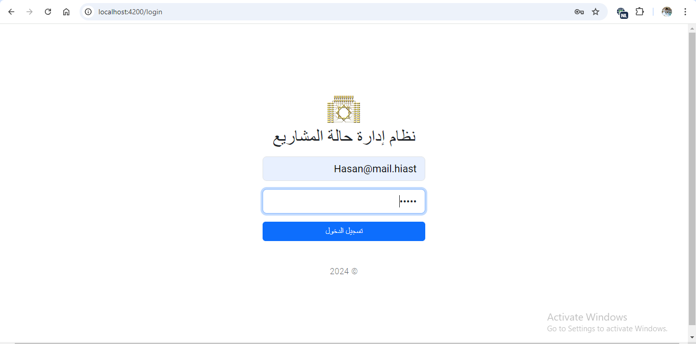
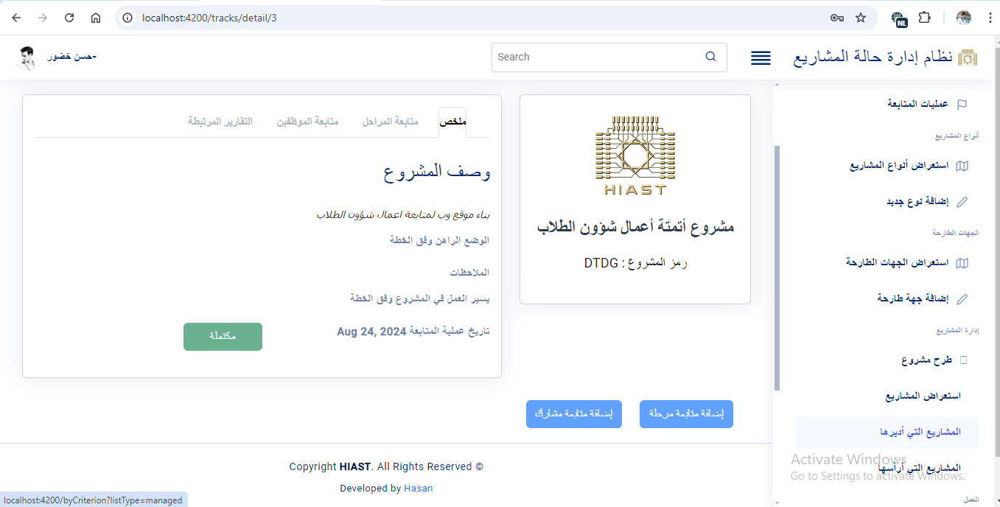
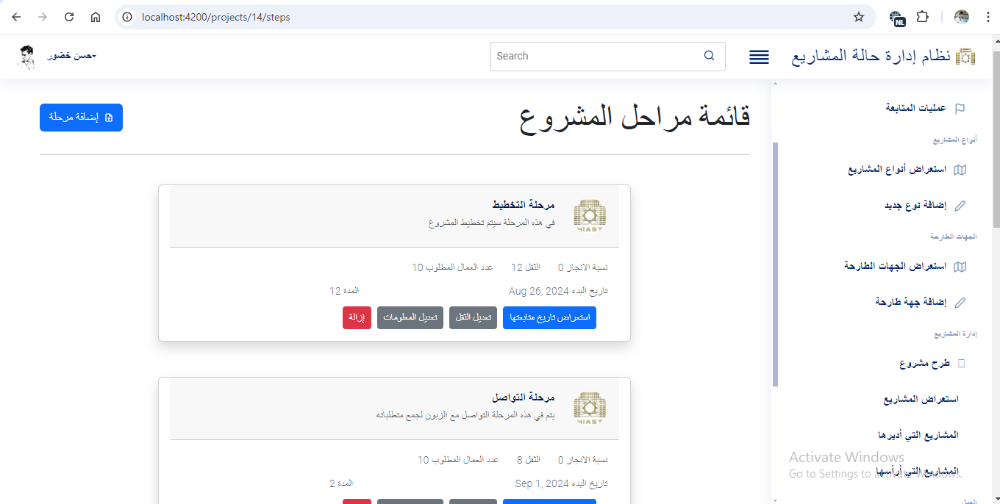
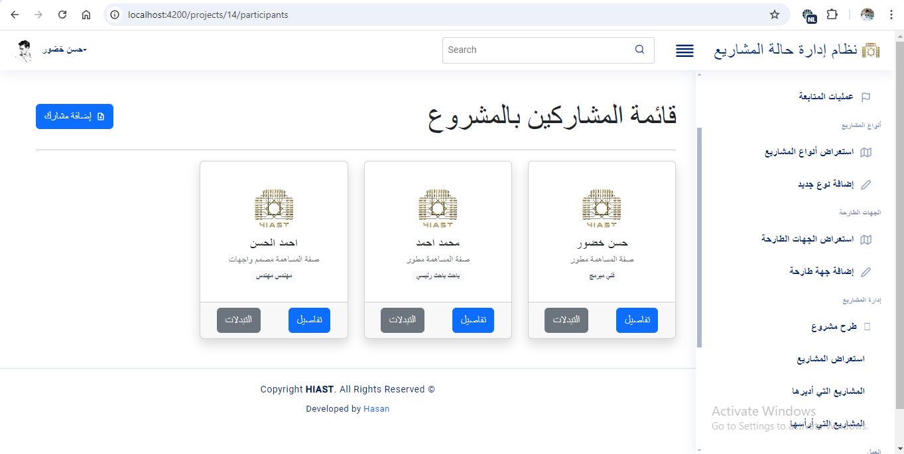
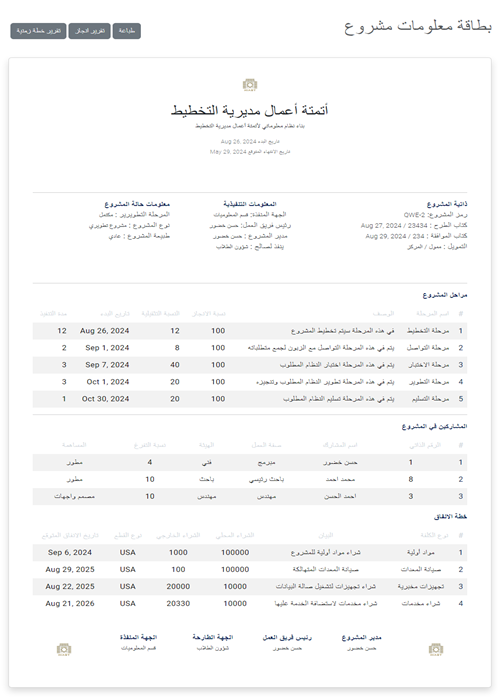
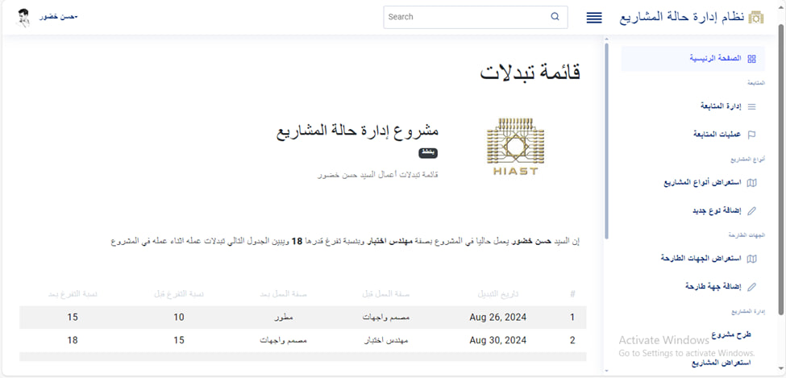
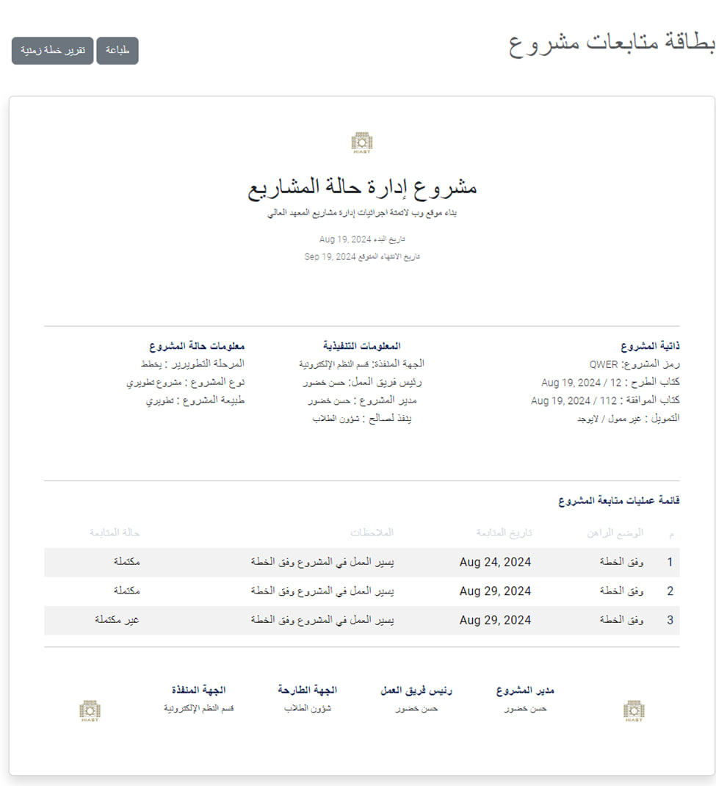
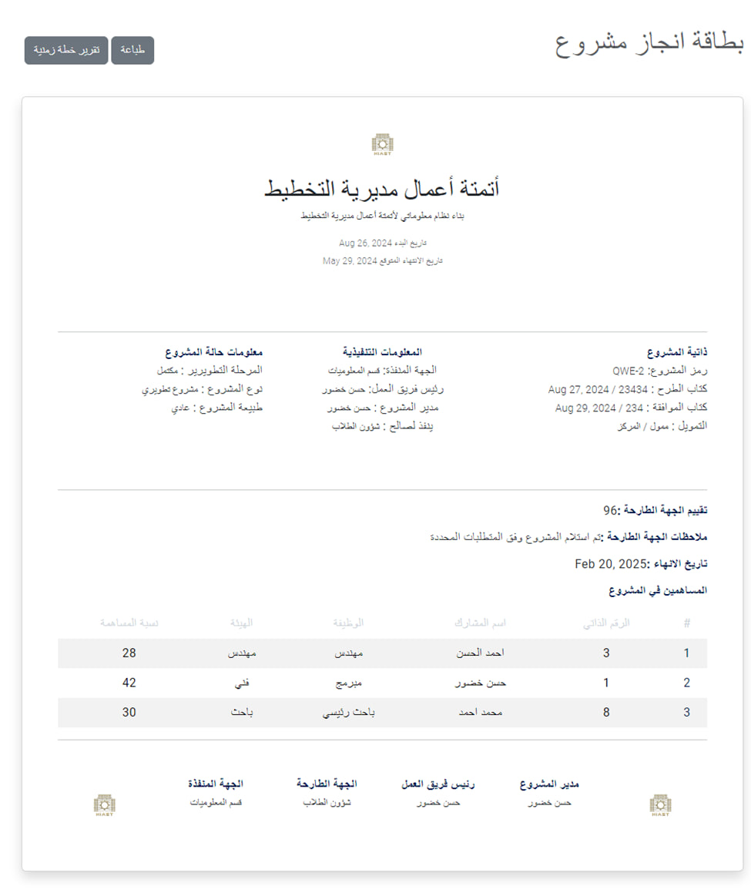
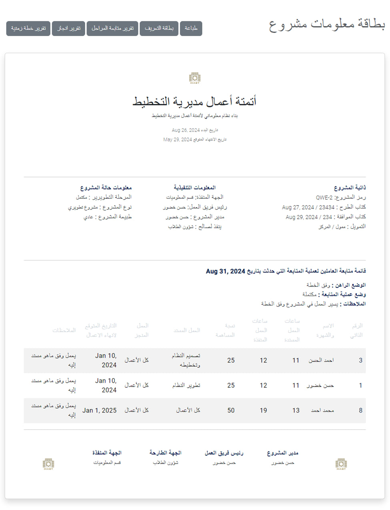

# Projects Status Managerment UI 

> this is the front-end side of the project 

## Table of content
1. Theoretical Intro. 
2. Solution Architecture
3. Solution Componenets  
4. Environment Varibales
5. Pages & Features
6.  Get Started 
7. Conclusoin & recomendation

___
## Theoretical Introduction
> this chapter will explain the principles \
> that we use it to develop our frontend app 

### **Feature-Based Decomposition and Angular Modules**

Feature-based decomposition is a design principle that emphasizes organizing an application around its features, making the structure clear and maintainable. In Angular, this concept is implemented through modules, which serve as the fundamental building blocks of an application. Each module encapsulates a specific feature or functionality, containing components, services, directives, pipes, and routing configurations relevant to that feature.

Angular modules promote modularity by isolating concerns, which enhances code reusability and simplifies maintenance. For example, a project management application might have separate modules for projects, tasks, and users, each responsible for handling its specific logic and interactions.

Modules in Angular not only help in organizing code but also facilitate lazy loading. This technique ensures that certain modules are only loaded when needed, improving the application's performance. Additionally, Angular's dependency injection system works seamlessly within modules, allowing for efficient resource management and testing.

The use of feature-based decomposition through modules in Angular fosters a scalable and flexible architecture, enabling developers to manage complex applications with ease while maintaining a clear separation of concerns.
### **Benefits of Feature-Based Decomposition in Angular**

Feature-based decomposition in Angular offers several benefits that enhance the development and maintainability of applications:

    1. Modularity: It isolates features into self-contained modules, making the codebase easier to manage and understand.


    2. Reusability: Code components, services, and directives within a module can be reused across different parts of the application or even in other projects.

    3. Scalability: By organizing code by feature, applications can grow without becoming unmanageable, as each module focuses on a single responsibility.

    4. Lazy Loading: Improves performance by loading modules only when required, reducing the initial load time of the application.

    5. Collaboration: Facilitates teamwork by enabling developers to work on different features independently without conflicts.

    6. Maintainability and Testability: With a clear separation of concerns, debugging, updating, and testing specific features become straightforward. Each module can be tested in isolation, ensuring robust and reliable code.

By leveraging these benefits, Angular developers can create scalable, maintainable, and efficient applications that align well with the principles of modern software development.


_
## Soltution Architecture
> in this chapter we will explain the architecture of the frontend application \
and we will discuss the desired soltuion

### **General Overview of System**


### **Our Application Features**
* As we mention in the report in the chaeter of system designe in paragraph **1.7 Design Principles** we have in our application 6 domains which is as the follow : 

        1. Projects Domain
        2. Projects Types Domain
        3. Customers Domain
        4. Employees Domain
        5. Tracking Domain 
        6. Steps Domain 

so to respect this principles in deveplopment the fron end side we chose these domains as a features so its become our application modules. And in this level we care about the reports that we can generate so we will add a report module.

### **Module Architecture**
In each module of our aplication we have the same folder  structure as the follow :

    1. Components :
    in the componenet we put our componenets that like modals and so. this componentwe ggregate it to get a page 

> 


    2. Models :
    in the models folder we have a three inner folders which is (Requests) & (Responses) & (Values Objects).
    
    in the request folder we put out request interfaces that we use it in component to send it as a request to the server via API
    
    in the responses folder we put our responses that we expect the server to return it>

    int the valu object folder we put the models that are just a value holder and is not a response and a request.
>

    3. Pages : 
    in the pages folder we put our stand alone component that the client can request it via routing.
>
    4. Routing
    in the routing folder we put our routing rules that rout the url to a specicfied component in the pages folder.
>
    5. Services :
    in this folder we will put our services that will communicate with the backend server via requests which is defined in the request folder
> 
    6. finally, each module folder has a module file in it we decalre our imports and exports 

and in addition to this modules there are a two additional module 
which is the Core Modules and Shared Module.


### **General Folder Structure** 
```plaintext
PSManagement UI/
├── src/
│   ├── app/
│   │   ├── core/
│   │   │
│   │   ├── projects/
│   │   │
│   │   ├── projects Types/
│   │   │
│   │   ├── tracks/
│   │   │
│   │   ├── employees/
│   │   │
│   │   ├── customers/
│   │   │
│   │   ├── reports/
│   │   │
│   │   ├── shared/
│   │   └── services/
│   ├── assets/
│   │   └── images/
│   │
│   └── environments/
│       └── environment.prod.ts
├── angular.json
├── package.json
└── README.md

```
___
## Solution Componenets  

### Projects Module 
> in this dimain we care about the proposing of the project and add its planning managment \
> we mean by planing management : 
> 1. Financial Spend management 
> 2. Step management 
> 3. Attacment managment 
>  

#### Project Module Strucure
we wil talk only for one module beacuse the rest modules has the same structure  

```plaintext
Project Module/
│   ├── Services/
│   │   
│   ├── Componenets/
│   │
│   ├── Models/
│   │   ├── requests/
│   │   │
│   │   ├── resposnes/
│   │   │
│   │   └── value objects/
│   │   
│   ├── pages/
│   │   
│   └── routing/
│   
└──  project.module.ts

```
#### what this module contain? 
* in the page folder we have the following pages :

        1. finacial spends  page 
        2. paricipants changes history
        3. project attachments page
        4. project list for manager and leader
        5. project detail (dash board)
        6. project list for Scientific deputy 
        7. stpel management 
        8. project propose page 
>
* in the services page we have a three servcies which are : 

            1. Project service :
         in it we communicate with the projects controller via sending a request from the models/requests folder and receiving responses which interface are in the models/reposnse folder
            2. financial spends service 
            3. steps service

and here the are are  and example of function in a project srevice 
``` ts
 public addParticipant (
    request : AddParticipantRequest
 ): Observable<ParticipationResponse>

```
>

* in the models / reuqest folde we have three foler one  for project request and one for step and the last for financial spend 
in the requests for projecthere are an example of them :

        Add Attachment Request 
        Add Participant Request 
        Cancel Project Request 
those reuqets the service send them and receive a response whoch its interface are defined in the reponse doler 

>
* the routing folder contain file for routing 
like /projects/create to activate the create project page(componenet)

__

### Core Module
> this module are the core of the aplication its loaded first  of all after the app component and it has the main services that are sharec like authentication\ 
> and it has the guards 

#### Core Module Structure 
```plaintext
Core Module/
│   ├── services/
│   │   
│   ├── guards/
│   │
│   ├── interceptors/
│   │   
│   ├── models/
│   │   
│   └── constants/
│   
└──  core.module.ts

```


#### what this module contain?
this module cntain the follwoing things
* guards foolder conatin two guard :

        1. authentication gurard 
        responsiblie to navigate an authenticated user to the /login page 
        2. role gurad which prevent the an authorized users from activate  a component.
* interceptor has two interceptors one for adding jwt to the http requests before sending it. and the secind one for loadig a spinner when sending a reuqest.

* models folder which conatin the common models in the app

* service folder which conatin the common services in the app lkie auth and user provdering>


* constants folder contain the constants varialbe like th roles of the users  

__

### Shared Module
> this module are the shared module of the aplication its containe the shared component and pipes in the app  

#### Shared Module Structure 
```plaintext
Shared Module/
│   ├── components/
│   │   
│   ├── pipes/
│   │
│   ├── constants/
│   │   
│   └── shared layout/
│   
└──  shared.module.ts

```


#### what this module contain?
this module cntain the follwoing things
* the shared component in the app 
* the shared pipes in the app 
* the directives in the app
___
in addition to this modules there  are the pages folder which contain the static pages in the app 
___
## Environment Varibales
the environment folder conatin a two files 

the first is for the development environment variables and the second for production 
and this files contain the config option and variable like the server url and app name 
___
## Get Started 
> thsi chapter explain how to run the app on your device 

### Prerequisites

Make sure you have the following installed:

- [Node.js](https://nodejs.org/) (v12.x or higher)
- [npm](https://www.npmjs.com/) (v6.x or higher)
- [Angular CLI](https://angular.io/cli) (v12.x or higher): Install via `npm install -g @angular/cli`

### Clone the project 
you can clone the project via this code 
```bash
git clone https://git.hiast.edu.sy/hasan.bahjat/psmanagementui.git
cd PSManagmentUI
```
### Install the node modules 
```bash
npm install 
```

### Congiure the envirment 
set the server url due to the backend server port 
### start the frontend server 
```bash
ng s 
```
### See it 
open your browser and type localhost:4200:/


__
## Pages and Features 
> in this chapter i will put some feature of the project and some pages screenshots

## Pages

### Home and login pages 




### Tracking and Definition 



### Participants and plan management

 




### Reports 






___
## Conclusion & recomendation
The Projects Status Management UI offers a comprehensive and modular approach to managing project-related activities in an efficient and organized manner.
 By employing feature-based decomposition in Angular, the application is structured to provide high scalability, maintainability, and reusability. This design choice facilitates independent development and testing of each feature module, enhancing collaboration among development teams and improving overall productivity.
and for recomendation, we recommend to apply lazy loading emphasize the performance of the app and its goo architcture


